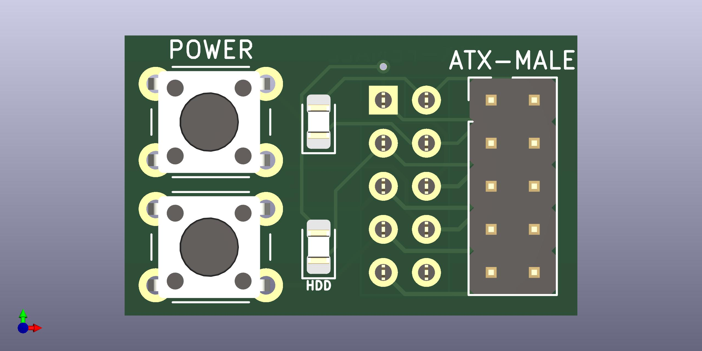

# atx-front-panel
A simple KiCad project to provide buttons and indicator LEDs for a standard ATX motherboard front header.

## BOM / Parts List

| Count | Part |
| --- | --- |
| 2 | 6x5mm through-hole push buttons |
| 2 | 0805 SMD LEDs |
| 1 | 2x5 2.54 vertical pin header, male | 
| 1 | 2x5 2.54 vertical pin header, female | 